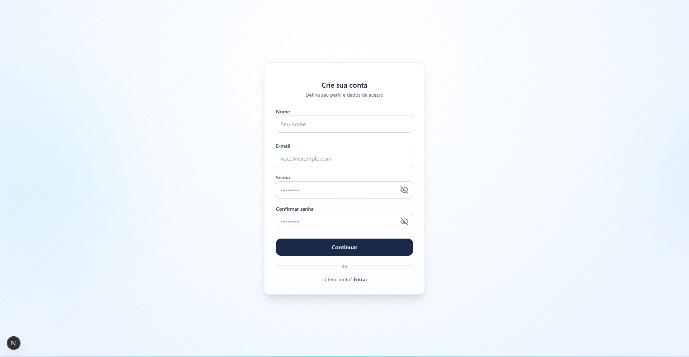
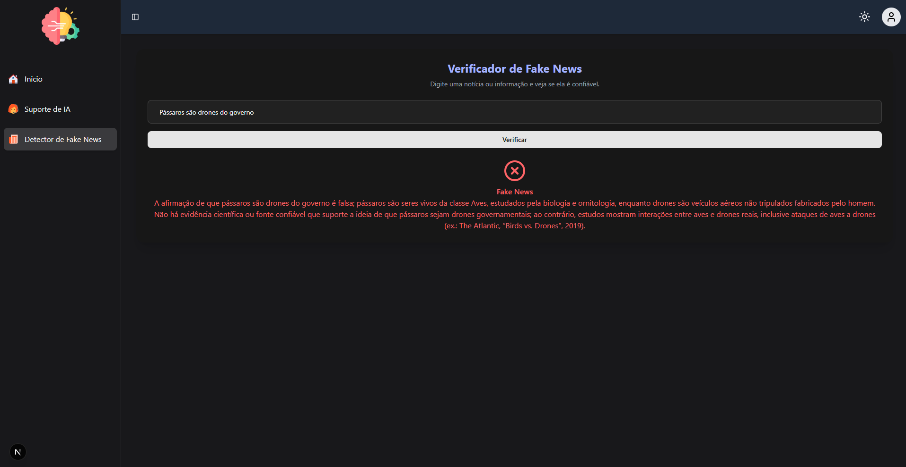
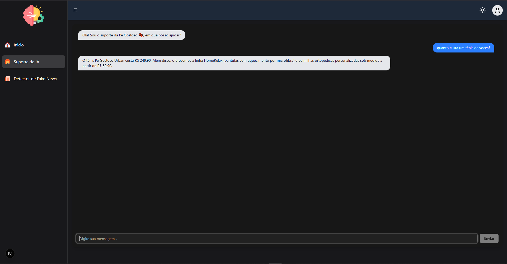

# 🧠 Projeto Marcio
---

Plataforma web focada em **conscientização sobre fake news**, **suporte ao usuário** e **gestão de contas**, construída com uma arquitetura moderna envolvendo FastAPI, Next.js, Supabase e integração com IA.

---

## 🌐 Veja o projeto hospedado [aqui](https://projetomarcio.netlify.app/)

---

## 🎯 Objetivo
O **Projeto Marcio** oferece:

- Análise e conscientização sobre fake news
- Chat de suporte inteligente
- Autenticação segura
- Experiência rápida e escalável

---

## 🧰 Tecnologias Utilizadas

### 🔧 Back-end
- FastAPI (Python)
- Supabase (PostgreSQL + Auth)
- JWT para autenticação
- Groq API (IA)

### 🎨 Front-end
- Next.js (React)
- TailwindCSS
- Axios

### 🗄️ Banco de Dados
- Supabase PostgreSQL

### 🤖 Inteligência Artificial
- Integração com Groq API e uso de ChatGPT/Copilot no desenvolvimento

---

## 🏛️ Arquitetura da Aplicação
- Frontend e backend separados  
- Comunicação via API REST  
- Autenticação via JWT  
- Dados e usuário gerenciados pelo Supabase

---

## 🧩 Diagrama da Arquitetura
```
                ┌──────────────────────┐
                │       Usuário        │
                └──────────┬───────────┘
                           │
                           ▼
                ┌──────────────────────┐
                │     Frontend         │
                │      Next.js         │
                └──────────┬───────────┘
                           │
                           ▼  API REST (HTTPS)
       ┌─────────────────────────────────────────┐
       │                 Backend                 │
       │                 FastAPI                 │
       └──────────┬──────────────┬──────────────┘
                  │              │
                  ▼              ▼
          Autenticação      Análise IA
                  │
                  ▼
      ┌──────────────────────────┐
      │        Supabase          │
      │  PostgreSQL + Policies   │
      └──────────────────────────┘
```

---

## 🏗️ Estrutura do Projeto
```
Projeto-Marcio/
├── backend/
│   ├── app/
│   └── Dockerfile
├── frontend/
│   ├── src/
│   └── Dockerfile
├── docker-compose.yml
└── README.md
```

---

# 🚀 Como Rodar o Projeto com Docker

A forma oficial e recomendada de rodar o Projeto Marcio é usando Docker Compose.

---

## 📦 1. Pré-requisitos
- Docker instalado
- Docker Compose instalado
- Arquivos .env configurados

---

## 🧩 2. Variáveis de ambiente

### backend/.env
```
SUPABASE_URL=
SUPABASE_KEY=
JWT_SECRET=
GROQ_API_KEY=
```

### frontend/.env.local
```
NEXT_PUBLIC_API_URL=http://localhost:8000
```

---

## ▶️ 3. Subir tudo
```
docker-compose up --build
```

---

## ⏹ 4. Parar containers
```
docker-compose down
```

---

## 🔄 5. Forçar rebuild
```
docker-compose up --build --force-recreate
```

---

# 📸 Prints do Sistema
---

Abaixo estão alguns prints que ilustram as principais telas e funcionalidades do Projeto Marcio, incluindo:
Todos os prints estão localizados na pasta:

📁 /Arquivos





---

# 🎥 Vídeo Demonstrativo
---

Um vídeo completo demonstrando o funcionamento do sistema — incluindo navegação, autenticação, análise de fake news e interação com IA — está disponível em:

📁 /Arquivos
🎬 video demonstração.mp4

Esse vídeo serve como material oficial de apresentação do Projeto Marcio.
